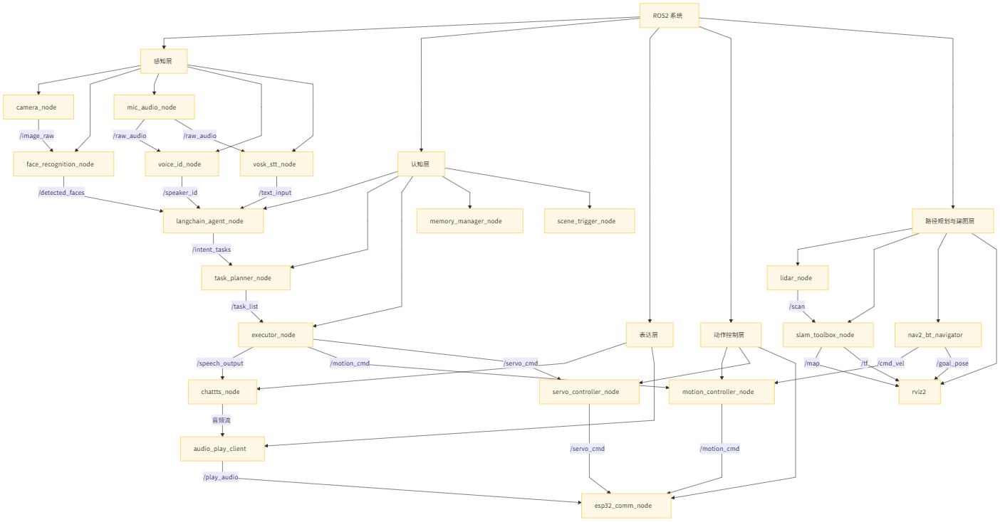

## walle ROS2 系统

### 一、系统总览

树莓派运行 ROS2，主要负责语音识别、图像识别、智能任务规划、路径导航、语音合成与动作控制等任务。各模块分工明确，采用话题（topic）、服务（service）和动作（action）进行节点间通信。

---

### 二、ROS2 节点组成与通信

#### 1. 感知层

| 节点名称                    | 语言     | 说明                  | 发布/订阅话题                                                 |
| ----------------------- | ------ | ------------------- | ------------------------------------------------------- |
| `camera_node`           | Python | 使用 `cv_camera` 获取图像 | `/image_raw` (sensor\_msgs/Image)                       |
| `face_recognition_node` | Python | 人脸检测 + 特征比对         | 订阅 `/image_raw`，发布 `/detected_faces` (std\_msgs/String) |
| `mic_audio_node`        | C++    | 接收 ESP32 发来的音频流     | 发布 `/raw_audio` (自定义)                                   |
| `voice_id_node`         | Python | 声纹识别，身份确认           | 订阅 `/raw_audio`，发布 `/speaker_id` (std\_msgs/String)     |
| `vosk_stt_node`         | C++    | 音频转文本（高性能）          | 订阅 `/raw_audio`，发布 `/text_input` (std\_msgs/String)     |

---

#### 2. 认知层

| 节点名称                   | 语言     | 说明                              | 发布/订阅话题                                                                                   |
| ---------------------- | ------ | ------------------------------- | ----------------------------------------------------------------------------------------- |
| `langchain_agent_node` | Python | 多模态智能解析、子任务拆解（如 browse/use/ask） | 订阅 `/text_input`、`/speaker_id`、`/detected_faces` 发布 `/intent_tasks` (std\_msgs/String) |
| `task_planner_node`    | Python | 任务规划器，生成有序执行计划                  | 订阅 `/intent_tasks`，发布 `/task_list`                                                        |
| `executor_node`        | Python | 子任务执行调度器                        | 订阅 `/task_list`，调度动作/语音                                                                   |
| `memory_manager_node`  | Python | 上下文向量存储与记忆调用                    | 提供服务 `get_context(speaker_id)`、`store_context(data)`                                      |
| `scene_trigger_node`   | Python | 场景感知 + 长时间无人互动触发说话              | 发布 `/text_input`                                                                          |

---

#### 3. 表达层

| 节点名称                | 语言     | 说明                 | 发布/订阅话题                                               |
| ------------------- | ------ | ------------------ | ----------------------------------------------------- |
| `chattts_node`      | Python | 文字转语音              | 订阅 `/speech_output` (std\_msgs/String)，生成音频流发送至 ESP32 |
| `audio_play_client` | Python | 通过 TCP 将音频发至 ESP32 | 服务：`/play_audio(audio_bytes)`                         |

---

#### 4. 动作控制层

| 节点名称                     | 语言  | 说明                  | 发布/订阅话题                                                |
| ------------------------ | --- | ------------------- | ------------------------------------------------------ |
| `motion_controller_node` | C++ | 底盘运动控制器             | 订阅 `/motion_cmd` (geometry\_msgs/Twist)                |
| `servo_controller_node`  | C++ | 舵机控制器（头、手臂）         | 订阅 `/servo_cmd` (std\_msgs/String 或 Float32MultiArray) |
| `esp32_comm_node`        | C++ | 与 ESP32 进行 TCP 控制通讯 | 提供服务 `send_motor_cmd()`、`send_servo_cmd()`             |

---

#### 5. 路径规划与建图层

| 节点名称                | 语言  | 说明                        | 发布/订阅话题                             |
| ------------------- | --- | ------------------------- | ----------------------------------- |
| `lidar_node`        | C++ | 激光雷达驱动（如 RPLIDAR、YDLIDAR） | 发布 `/scan` (sensor\_msgs/LaserScan) |
| `slam_toolbox_node` | C++ | 2D/3D 实时建图（SLAM Toolbox）  | 订阅 `/scan`，发布 `/map`、`/tf`          |
| `nav2_bt_navigator` | C++ | Nav2 行为树导航                | 接收 `/goal_pose`，生成 `/cmd_vel`       |
| `rviz2`             | 可视化 | 查看地图、路径、目标点               |                                     |

---

### 三、话题与服务列表

#### Topics（话题）

* `/image_raw` → 图像流（sensor\_msgs/Image）
* `/detected_faces` → 人脸识别结果（std\_msgs/String）
* `/raw_audio` → 接收到的音频（自定义）
* `/speaker_id` → 声纹识别结果（std\_msgs/String）
* `/text_input` → 识别后的文本（std\_msgs/String）
* `/intent_tasks` → LangChain 拆分的意图（std\_msgs/String）
* `/task_list` → Task Planner 输出的任务序列（std\_msgs/String\[]）
* `/speech_output` → 要说的话（std\_msgs/String）
* `/motion_cmd` → 底盘运动控制（geometry\_msgs/Twist）
* `/servo_cmd` → 舵机指令控制（Float32MultiArray）
* `/scan` → 激光雷达数据（sensor\_msgs/LaserScan）
* `/map` → 地图（nav\_msgs/OccupancyGrid）

#### Services（服务）

* `/play_audio(audio_bytes)`
* `/send_motor_cmd(geometry_msgs/Twist)`
* `/send_servo_cmd(ServoCommand)`
* `/get_context(speaker_id)`
* `/store_context(data)`

---

### 四、LangChain

“去厨房看看冰箱有什么，然后告诉我”：

1. `vosk_stt_node`：识别出文本。
2. `langchain_agent_node`：拆分为：

   * `use_camera("kitchen")` → 图像推理任务
   * `browse_object("fridge")` → 多模态推理子任务
   * `ask("what's inside")` → 语言总结子任务
3. `task_planner_node`：生成顺序：移动 → 图像 → 语音总结
4. `executor_node`：下发动作 → 控制节点 → ChatTTS 合成回复

---
